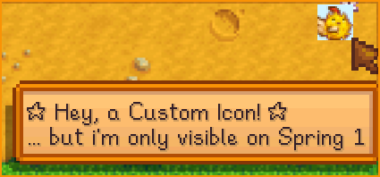



  

  

  This is an alternative fork of <a href="https://github.com/Annosz/UIInfoSuite2">UIInfoSuite2</a> with additional features and bug fixes.

  <h3><strong>Why Alternative?</strong></h3>
  Since upstream development has slowed, this fork aims to keep the mod alive by fixing outstanding issues and adding features that felt missing. All credit for the mod goes to them.
    
  Thanks to <a href="https://github.com/Annosz">Annosz</a>, <a href="https://github.com/tqdv">tqdv</a>, <a href="https://github.com/drewhoener">drewhoener</a>, <a href="https://github.com/cdaragorn">cdaragorn</a>, and all the contributors who built and maintained UIInfoSuite over the years. Their work made this mod what it is today.

  

  
  

  <h3 align="center">Custom Icons</h3>

  <b>If you're a Content Patcher mod author take a look at: 
  <a href="docs/custom-icons.md">Custom Icons Documentation</a></b>

❤️ Big **THANK YOU** to All Translators that make this mod available in so many different languages! ❤️

- [中文](https://www.nexusmods.com/stardewvalley/mods/43147) - passersby10086
- [Português](https://www.nexusmods.com/stardewvalley/mods/43172) - Maatsuki
- [Русский](https://www.nexusmods.com/stardewvalley/mods/43168) - ReyRoyce
- [Tiếng Việt](https://www.nexusmods.com/stardewvalley/mods/43298) - valesaren
- [日本語](https://www.nexusmods.com/stardewvalley/mods/43335) - tchuks
- [Türkçe](https://www.nexusmods.com/stardewvalley/mods/43359) - Bortakbosna
- [한국어](https://www.nexusmods.com/stardewvalley/mods/43452) - jjongleee
- [Española](https://www.nexusmods.com/stardewvalley/mods/43900) - SrNemoa
- [Magyar](https://www.nexusmods.com/stardewvalley/mods/45218) - ArcsiHUN
- [Polski](https://www.nexusmods.com/stardewvalley/mods/45467) - zieloneoczka
- [Français](https://www.nexusmods.com/stardewvalley/mods/46333) - Furaxx31
- [Bahasa Indonesia](https://www.nexusmods.com/stardewvalley/mods/46341) - BabangUcok
- [български](https://www.nexusmods.com/stardewvalley/mods/45619) - AcTePuKc

> Most new features can be toggled on/off in the mod's in-game options menu.

- **v2.8.30**
  - Responsive mod options menu: long translated labels now wrap and expand their slot height instead of being cut off or overlapped ([#2](https://github.com/dazuki/UIInfoSuite2Alt/pull/2)) [@CpdnCristiano](https://github.com/CpdnCristiano)
  - Fix mail counter number alignment and resize for double-digit counts ([#2](https://github.com/dazuki/UIInfoSuite2Alt/pull/2)) [@CpdnCristiano](https://github.com/CpdnCristiano)
  - Fix crash when hovering crops from mods that set a minimum harvest quality (e.g. always gold/iridium)
  - Fix item effect range grid not aligning with the actual placement tile when placing items with a gamepad
- **v2.8.29**
  - Add HUD icon showing when the Movie Theater crane game is available today
  - Fix crash when hovering modded seeds/saplings with randomized harvest items in shops
  - Fix tooltip event spam when other mods (e.g. Item Extensions, Alternative Textures) crash inside their Harmony patches during harvest item lookup
  - Fix potential crash when `IconsPerRow` is manually set to 0 in config.json
  - Add a note explaining how the "Show loved gifts in tooltip" Birthday option populates its list
- **v2.8.28**
  - Item effect range tiles now use the vanilla game sprite (same as original UIInfoSuite2) instead of the custom muted tile texture
  - Fix item effect range (sprinklers, scarecrows) not highlighting tiles occupied by Garden Pots
  - Minor internal code cleanup
- **v2.8.27**
  - Fix NRE crash in artisan price tooltip when a mod's machine data contains null output rules
  - Fix [Ferngill Simple Economy](https://www.nexusmods.com/stardewvalley/mods/21414) tooltip shift applying even when FSE's tooltip is disabled in its config
  - Fix artifact spot tooltip showing wrong item for [SpaceCore](https://www.nexusmods.com/stardewvalley/mods/1348)-managed till spots (e.g. Cornucopia Ube Seeds showing as Winter Root)
  - Fix Golden Walnut counter overlapping the Volcano Dungeon level counter in the top-left corner
  - Fix item effect range not displaying inside Slime Hutch (including water trough coverage)
- **v2.8.26**
  - Add keybind to open Qi's Special Orders board directly (default: Ctrl+Q)
  - Fix redundant suffix addition to fruit tree names in other languages
  - Increase custom icons cap from 5 to 15
- **v2.8.25**
  - Add option to gate sell/stack/artisan prices and shop harvest prices behind reading the Price Catalogue (default off)
  - Add Skull Cavern hole hover tooltip showing the destination floor and fall distance
- **v2.8.24**
  - Fix random crash on garbage can hover with [Binning Skill](https://www.nexusmods.com/stardewvalley/mods/14073) installed
  - Item effect range overlay now uses the single muted tile texture instead (same sprite being used as bomb area)
- **v2.8.23**
  - Add garbage can tooltip showing todays content
    - [Binning Skill](https://www.nexusmods.com/stardewvalley/mods/14073) compatibility: shows required level when the can is locked
    - [Garbage Day](https://www.nexusmods.com/stardewvalley/mods/8204) compatibility: lists pre-rolled chest contents (up to 5, with "+X ..." overflow)
  - [Custom Museum Framework](https://www.nexusmods.com/stardewvalley/mods/34530) compatibility: show donation icon on item hover for undonated items in modded museums
    - Added icon for [Visit Mount Vapius](https://www.nexusmods.com/stardewvalley/mods/9600) Natural Reserve
  - [Sunberry Village](https://www.nexusmods.com/stardewvalley/mods/11111) Museum compatibility: show Elias donation icon on item hover for items required by an active Sunberry Museum special order
  - Fix double shadow on mod options tab tooltip
- **v2.8.22**
  - Fix performance issues on item pickup when an NPC birthday is active
  - Fix fruit tree tooltip showing raw `Strings\Objects:...` path when a CP mod's LocalizedText key is missing (e.g. RSV)
- **v2.8.21**
  - Expand NPC birthday icon tooltip with friendship hearts and loved gifts the player owns (green = in inventory). Toggleable via "Show loved gifts in tooltip"
  - Show half hearts when friendship is between whole heart levels on Animal builing tooltip
  - Fix duplicated tooltip on ammo-based items and double shadow on tooltips in the inventory menu
  - Fix gamepad right-navigation from clothing slots skipping Calendar/Billboard when trinket slot is absent
- **v2.8.20**
  - Add "Max rows shown" dropdown for artisan tooltip (default 10, options: 5/10/15/20/30/50/100)
  - Exclude Binning Skill Composter from artisan machine tooltips
  - Fix artisan tooltip showing wrong icon and price for fish roe
  - Fix golden walnut tracker always showing Golden Coconut as incomplete
- **v2.8.19**
  - Show artisan good sell prices on item hover (sub-option under "Show item hover information")
    - Lists each matching vanilla/modded machine output with unit price, stack range, and total for the current stack
    - "...for known/owned machines" sub-option filters rows to machines the player has crafted or placed
    - Excludes some machines for now with non-artisan or randomised outputs (Cask, Crystalarium, Recycling Machine, Seed Maker, Slime Incubator, Charcoal Kiln, Slime Egg-Press)
  - Correct shipping bin and bundle banner icon position when the extended tooltip is disabled
  - Icons now track the vanilla tooltip shift that occurs while holding an item on the cursor
- **v2.8.18**
  - Animal building tooltip: hover over Coops/Barns to see animal count, hold keybind for detailed animal list with status icons
- **v2.8.17**
  - Show harvest price for [Custom Bush](https://www.nexusmods.com/stardewvalley/mods/20619) saplings in shops (e.g. [Cornucopia](https://www.nexusmods.com/stardewvalley/mods/19508))
  - Add option to disable the "Trees Hidden/Minimized" HUD banner in GMCM
  - Shipping bin icon now uses vanilla game sprites instead of a custom texture, allowing Content Patcher retextures to apply
  - Fix F8 keybind not opening mod options tab
- **v2.8.16**
  - [Animal Husbandry](https://www.nexusmods.com/stardewvalley/mods/1538) compatibility:
    - Queen of Sauce icon shows Meat Friday recipes on Fridays
  - Show live grange display score overlay during the Stardew Valley Fair
  - Show HUD banner when trees are minimized, displaying the keybind to restore them
  - Use smaller font for HUD icon tooltips
  - Fix books (Powers tab items) incorrectly showing the shipping collection icon
- **v2.8.15**
  - [Walk of Life](https://www.nexusmods.com/stardewvalley/mods/24355) compatibility:
    - Experience bar supports prestige levels (11-20) with correct XP curve
    - Ecologist/Gemologist quality predictions on forageable/mineral tooltips
    - Angler/Producer sale bonus shown on item hover tooltip
  - Add ground mineral tooltip in caves/mines (gems, minerals)
  - [Better Junimos](https://www.nexusmods.com/stardewvalley/mods/2221) compatibility: ([#1](https://github.com/dazuki/UIInfoSuite2Alt/pull/1)) [@PaulEndri](https://github.com/PaulEndri)
    - Junimo hut range uses configured radius
  - Controller:
    - Trinket slot and Trash can now navigate to inventory icons with controller
    - Mod options tab is now reachable with controller
    - Dropdowns and number pickers in mod options now work with controller-style menus
  - Cask tooltip now shows per-quality aging progress with star icons
  - Fix machine tooltip showing misleading hour/minute countdown for day-based machines
- **v2.8.14**
  - Add hide trees keybind (Default: F7)
    - Toggles full-grown tree visibility with animated transitions
  - Show [Archaeology Skill](https://www.nexusmods.com/stardewvalley/mods/22199) icon on artifact tooltip when player has Antiquarian profession
- **v2.8.13**
  - Add artifact spot tooltip showing predicted drops (supports [Farm Type Manager](https://www.nexusmods.com/stardewvalley/mods/3231) buried items)
  - Fix calendar return-to-inventory blocking other mods from detecting calendar close (e.g. [Harvest Calendar](https://www.nexusmods.com/stardewvalley/mods/25103))
  - Fix cases where assets couldn't be found and failed to start mod/SMAPI. Logs as an error message now instead
- **v2.8.12**
  - Show item quality star on pickup HUD notifications
    - Will use [Show Item Quality](https://www.nexusmods.com/stardewvalley/mods/22275) mod if it is installed instead
  - Show predicted harvest quality on crop and forageable world tooltips (toggleable)
  - Fix mailbox count not showing up on Ginger Island mailbox
  - Fix "Not watered" tooltip for forage crops (Spring Onion, Ginger)
  - Fix HUD icons overlapping with [Daily Tasks Report Plus](https://www.nexusmods.com/stardewvalley/mods/20871) icon
  - Fix range display for modded bee house variants (e.g. [Machine Progression System](https://www.nexusmods.com/stardewvalley/mods/21720))
  - Add sub-options for inventory item information (sell price tooltip, bundle banner, donation status, shipping status)
  - Add optional shipping bin icon for the collection/shipping indicator (off by default)
  - Add "Show world tooltips" master toggle with sub-options (crop, tree, machine, fish pond, forageable)
  - Add ground forageable tooltip (leeks, daffodils, etc.)
- **v2.8.11**
  - Add [Sword & Sorcery](https://www.nexusmods.com/stardewvalley/mods/12369) Special Orders board (Coastal Guild) to board selector
  - Fix heart fills on social page rendering above the mouse cursor and now uses actual heart sprite for Content Patcher compatibility
  - Prefer Informant's item tooltips when installed instead of blanket-disabling all UIIS2Alt tooltips from earlier patch
- **v2.8.10**
  - Add "Stack multiple birthdays" option
    - Consolidates 2+ birthday icons into one with count overlay and grouped tooltip
  - Add [Informant](https://www.nexusmods.com/stardewvalley/mods/21286) compatibility
    - Auto-disables overlapping tooltips (crop, tree, machine, item prices, bundles, museum, shipping) when Informant is installed
    - Registers [Stardew Aquarium](https://www.nexusmods.com/stardewvalley/mods/6372) donation indicator as an Informant item decorator
- **v2.8.9**
  - Fix pigs incorrectly showing truffle produce bubble
  - Fix buff expiry sound playing constantly in co-op/split-screen
  - Fix "Show fish on catch/quality star" not working for player 2 in co-op/split-screen
  - Fix bookseller icon, golden walnut tracker, and machine icons not using per-screen state in split-screen
- **v2.8.8**
  - (Hotfix) Soundfix for level_up.ogg
- **v2.8.7**
  - Improved animal petting and produce indicators with [Better Ranching](https://www.nexusmods.com/stardewvalley/mods/859) compatibility
    - Fix farm animal icons (needs petting, produce ready) not showing on non-farm locations
  - Pressing the keybind that opened a calendar, quest board, or special orders board now closes it
    - Fix return-to-inventory not working when mods replace the quest board menu (e.g. [Help Wanted](https://www.nexusmods.com/stardewvalley/mods/14640))
- **v2.8.6**
  - Add [Unlockable Bundles](https://www.nexusmods.com/stardewvalley/mods/17265) API integration
    - Bundle tooltip now shows the actual bundle icon(UB content patcher data supported)
    - Item/Traveling merchant tooltip now detect UB bundle items
    - Item/Traveling merchant now respect room discovery and UB discovered bundles
    - Added "Reveal locked CC bundle items"-option to completly remove room discovery checks
  - Add sub-option to toggle placed item ranges (scarecrows, sprinklers, etc.) while holding an item
  - GMCM config now uses multi-page layout with page links for each feature section
    - In-game options tab now has collapsible sections with expand/collapse icons per category
  - Closing a Calendar, Billboard, Special Orders or Qi Board opened from inventory icons now returns to player inventory
  - Fix calendar/billboard/quest keybinds not working when "Show calendar/billboard button" option is unchecked
  - Fix vertical HUD icons overlapping the quest log icon by matching the game's own visibility check
  - Fix bundle item detection(tooltips + traveling merchant) missing items on save load due to stale game cache
  - Cached item range distance calculations to increase performance with many or modded large-radius scarecrows
  - Added more trace-level logging for easier troubleshooting
- **v2.8.5**
  - Show mail count on the mailbox bubble so you can see how many letters are waiting (toggable option)
  - Add Golden Walnut tracker on Ginger Island with hover panel showing collection progress by area (toggable options)
  - Improved the performance when showing item range highlights (sprinklers, scarecrows, etc.)
- **v2.8.4**
  - Fix Special Orders keybind opening the board before it's unlocked
  - Check for conflicting UIInfoSuite mod variants
  - Update CustomBush API to v1.5.2
- **v2.8.3**
  - Add SpaceCore custom skill support for experience bar (shows bar with skill icon, color, level, and XP progress)
  - Add Vanilla Plus Professions compatibility for extended skill levels (11-20) and Mastery unlock threshold
  - Add accumulated XP combo counter on the experience bar that stacks gains while the bar is visible(resets after exp bar disappears ~8sec)
  - Fix experience bar showing wrong skill inside FarmHouse
- **v2.8.2**
  - Show item icon on world tooltips (crops, trees, machines, fish ponds, bushes, buildings) and item range tooltips (sprinklers, scarecrows, bee houses, mushroom logs, wild trees)
  - Add keybind to open Special Orders board directly (Default: J), with mod board selector support
  - Fix blinding tile highlight for bombs and lowered opacity for all items showing tile highlights
  - Fix Ridgeside Village quest board not appearing in Billboard icon selector until Special Orders board event was seen
- **v2.8.1**
  - Item range tiles now only highlight valid tiles (skip non-tillable, occupied, and map-blocked tiles for sprinklers/scarecrows; skip occupied tiles for wild trees)
  - Range tooltip shows actual item name for single objects, category name for "show all"
  - Mystic Trees show "no seed spread" warning instead of range
  - Reachable tile count now reflects actual highlighted tiles
- **v2.8.0**
  - Reworked item range display when using the keybinds to check tile coverage
    - Add range tooltip showing reachable tiles, covered tiles, and overlap count (toggleable sub-option)
    - Show wild tree seed spread range on farms, with informational tooltip outside farm locations
    - Fix Junimo Hut to now properly follow the "Show current/all item range"-keybinds
  - Polish and improve layout for both in-game mod options page and GMCM options
  - Add "Open GMCM Options" button to in-game options tab for quick access to Generic Mod Config Menu to, for example, change keybindings
    - Shows a red notice text if GMCM is not installed
  - Quest board keybind now opens the board selector when Ridgeside Village is installed instead of only opening vanilla "Help Wanted!"
  - Output recommended mods to SMAPI console if they are not installed(GMCM, NPC Map Locations)
- **v2.7.1**
  - HUD icons now wrap to a new row/column when there are many icons active
    - Added "Icons before wrapping" dropdown option (1–10) to control how many icons appear per row/column
  - Improved positioning of custom CP icons and birthday icons a bit
  - Boosted SFX when a buff expires (+8 db)
- **v2.7.0**
  - Content Patcher mods can now add [Custom HUD Icons](docs/custom-icons.md)
  - Plays a sound effect when a buff expires (toggleable option)
  - Removed built-in `Show location of townsfolk`-option. Use the much better [NPC Map Locations](https://www.nexusmods.com/stardewvalley/mods/239) by Bouhm instead
  - Fix seasonal berry icon not respecting icon order setting
- **v2.6.9**
  - Changed the "Show crop and tree times" option into two new separate options:
    - "Show crop tooltip"
    - "Show tree tooltip"
  - Fix old upstream bug for regrowable crop tooltip showing incorrect days remaining when the crop was ready to harvest but left unpicked
  - Add machine options dropdown to GMCM
- **v2.6.8**
  - Fix translations not being applied to Icon Orders & Icon Style Dropdown text
- **v2.6.7**
  - Machine icons now have a mode selector (Off, Toggle, Hold) with hold-to-show keybind support
  - Fix tooltip text for bushes in green houses to ignore season checks
  - Fix experience-specific settings not being applied after game launch
- **v2.6.6**
  - Hotfix for custom weather icons using Cloudy Skies framework
- **v2.6.5**
  - Show a small item icon on machines that are currently processing, so you can see at a glance what each machine is working on without hovering (toggleable with F10 keybind)
  - Show the fish species icon on fish ponds so you can easily see what fish is in each pond
  - Show fish pond tooltip on hover with population, spawn timing, quest countdown, and golden cracker status
- **v2.6.4**
  - Add TV Fortune icon style for the luck HUD icon
  - Luck icon style is now a dropdown selector (Clover, Dice, TV Fortune) instead of a checkbox toggle
  - Improved vertical icon stacking: icons now start below the quest journal counter
- **v2.6.3**
  - Show tool upgrade icon for modded tools (e.g. [The Love of Cooking](https://www.nexusmods.com/stardewvalley/mods/6830))
  - Show festival/event start and end times on the festival reminder icon tooltip
  - Fix error/crash when modded animals have missing or unregistered produce data
  - Fix festival reminder not showing tomorrow's festival when a passive event is active today
- **v2.6.2**
  - Add Quest Board selection menu for [Ridgeside Village](https://www.nexusmods.com/stardewvalley/mods/7286)
  - Add Special Orders selection menu for [Visit Mount Vapius](https://www.nexusmods.com/stardewvalley/mods/9600)
  - Fix fruit tree tooltip showing "(no translation:...)" for Content Patcher mods with mismatched i18n keys (e.g. [Perfect Fruit](https://www.nexusmods.com/stardewvalley/mods/38413))
  - Fix cask tooltip calculation
- **v2.6.1**
  - Show [Stardew Aquarium](https://www.nexusmods.com/stardewvalley/mods/6372) donation indicator on fish item tooltips (Curator headshot, like Gunther for museum)
  - Add option to stack HUD icons vertically (downward from journal icon) instead of horizontally
  - Fix HUD icons and overlays showing during overnight farm events and minigames
  - Fix Traveling Merchant icon being invisible or look strange with certain Content Patcher mods
- **v2.6.0**
  - Show icon when there is extra forage to gather on The Beach during Summer
  - Show icon when there is a Pot of Gold at the End of the Rainbow 🌈
  - Show icon for Traveling merchant for [Ridgeside Village](https://www.nexusmods.com/stardewvalley/mods/7286) on Wednesdays
  - Add Special Orders board selection menu when detecting more available boards from mods (Currently: RSV, SBV & VMV)
  - Add gamepad navigation support for Calendar, Billboard, Special Orders, and Qi Orders icons in inventory
  - Add missing tree types to i18n for [Visit Mount Vapius](https://www.nexusmods.com/stardewvalley/mods/9600) and [Sunberry Village](https://www.nexusmods.com/stardewvalley/mods/11111)([Rose and the Alchemist](https://www.nexusmods.com/stardewvalley/mods/32385))
  - Improved fruit tree name resolution and tooltips for modded fruit trees
- **v2.5.5**
  - Add keybind to open Monster eradication goals (Default F9)
  - Fix tooltip showing up during special events/festivals/cutscenes
- **v2.5.4**
  - Fixed fertilizer string overlapping tooltip when using mods such as [Ultimate Fertilizer](https://www.nexusmods.com/stardewvalley/mods/21318)
- **v2.5.3**
  - (Hotfix)Reverted `LevelUp.ogg` to `LevelUp.wav` to fix certain audio/config issues in-game
- **v2.5.2**
  - Add [Cornucopia](https://www.nexusmods.com/stardewvalley/mods/19508) Corpse Flower & Date Palm tree to known treetypes
  - Add warning log for unknown/missing tree types
  - Adjusted icon margin for Calendar/Billboard icons
- **v2.5.1**
  - Add colored tooltips to crops for quick and better readability
  - Add [Cornucopia](https://www.nexusmods.com/stardewvalley/mods/19508) Sapodilla tree to known treetypes
  - Converted `LevelUp.wav` to `LevelUp.ogg` for smaller filesize
- **v2.5.0**
  - **Settings are now global**
    - All settings moved from per-save files to a single global `config.json`, applying across all save files
    - Old per-save settings files in `data/` are automatically renamed to `.json.old` on first load for reference
    - Full [Generic Mod Config Menu](https://www.nexusmods.com/stardewvalley/mods/5098) (GMCM) integration for all settings
- **v2.4.9**
  - Show exclamation mark on billboard icon in inventory when a daily quest is available
  - Add Special Orders & Mr. Qi's Special Orders board icons in inventory with animated exclamation marks when new orders are available and be able to accept new SO's through the clickable icons
  - Add option to switch between the new clover luck icon and the classic dice icon
- **v2.4.8**
  - Replace dice luck icon with custom 4-leaf clover spritesheet (8 tiers of luck, including Special Charm and shrine extremes)
  - Add [Ferngill Simple Economy](https://www.nexusmods.com/stardewvalley/mods/21414) compatibility: item sell price tooltip no longer overlaps with Ferngill's supply/demand bar
- **v2.4.7**
  - Split "Show crop and barrel times" option into separate "Show crop and tree times" and "Show machine and barrel times" options
  - "Show bomb range" is now a standalone option, no longer nested under "Show scarecrow and sprinkler range"
  - Fix crash when opening the social tab if the social page hasn't fully loaded yet
  - Add warning log when social page is not ready to help identify mod conflicts
  - Fix fishing festival names (Trout Derby, SquidFest) not showing translated names in non-English locales
- **v2.4.6**
  - Add alpha pulsation and color to buff duration timers
  - Lower quest counter opacity to blend with background colors better
  - Fix tooltip showing wrong or no name for Custom Bush Mods
- **v2.4.5**
  - Add icon sorting in options
  - Show buff duration timers below buff icons
  - Changed font visuals for experience bar and experience gain for better look and feel
  - Fix calendar and billboard icons turned invisible when hovered/picking up items in inventory
  - Fix incorrect width on social page when using Better Game Menu
  - Fix hover-text no being shown for garden pots when they are placed on flooring ([Annosz/UIInfoSuite2#638](https://github.com/Annosz/UIInfoSuite2/pull/638)) [@NermNermNerm](https://github.com/NermNermNerm)
- **v2.4.4**
  - Split calendar and billboard into two separate icons using game item sprites (more Content Patcher friendly)
  - Fix duplicate birthday icons appearing in multiplayer
  - Fix bundle item detection not including the Missing Bundle (Abandoned JojaMart)
- **v2.4.3**
  - Always show fish identity when reeling in (Sonar Bobber effect without the item)
  - Optional quality star overlay on the fish icon with real-time perfect catch bonus
- **v2.4.2**
  - Better Game Menu compatibility ([Annosz/UIInfoSuite2#648](https://github.com/Annosz/UIInfoSuite2/pull/648)) [@KhloeLeclair](https://github.com/KhloeLeclair)
- **v2.4.1**
  - Cloudy Skies framework compatibility: weather icon now supports custom weather from mods like [Weather Wonders](https://www.nexusmods.com/stardewvalley/mods/23868) ([Annosz/UIInfoSuite2#659](https://github.com/Annosz/UIInfoSuite2/issues/659)) [@toffi3](https://github.com/toffi3)
- **v2.4.0**
  - Show icon if there's a Festival/Event tomorrow or today
  - Option added to require watching TV daily to make Luck/Weather icon visible
- **v2.3.9**
  - Add hotkey to open mod options menu directly (Default: F8)
- **v2.3.8**
  - Show bookseller icon when he is visiting town
  - Show mastery experience bar and XP gains when all skills are at level 10
  - Show bundle items indicator on Traveling Merchant icon when the merchant has items needed for bundles
  - Show quest count under journal icon
  - Show recipe item as Queen of Sauce icon with mini TV overlay
  - Fix fruit tree drop parsing for DAY_OF_WEEK and non-day conditions (e.g. LOCATION_IS_OUTDOORS)
  - Fix CC bundle tooltips showing after Joja route or CC completion ([Annosz/UIInfoSuite2#572](https://github.com/Annosz/UIInfoSuite2/issues/572)) [@littlerat07](https://github.com/littlerat07)
  - Fix Ginger and Spring Onion displaying as "Unknown crop" ([Annosz/UIInfoSuite2#660](https://github.com/Annosz/UIInfoSuite2/issues/660)) [@FiveMountain](https://github.com/FiveMountain)
  - Fix mushroom log and mossy seed effect ranges ([Annosz/UIInfoSuite2#641](https://github.com/Annosz/UIInfoSuite2/pull/641)) [@Disassembler0](https://github.com/Disassembler0)

All mods listed here are **optional** and not required for UI Info Suite 2 Alternative.
The compatability ranges from small fixes to bigger integration with mod provided APIs.

- [Content Patcher](https://www.nexusmods.com/stardewvalley/mods/1915) ([Custom Icons](https://github.com/dazuki/UIInfoSuite2Alt/blob/main/docs/custom-icons.md) documentation for mod authors)
- [SpaceCore](https://www.nexusmods.com/stardewvalley/mods/1348)
- [Generic Mod Config Menu](https://www.nexusmods.com/stardewvalley/mods/5098)
- [Custom Bush](https://www.nexusmods.com/stardewvalley/mods/20619)
- [Better Game Menu](https://www.nexusmods.com/stardewvalley/mods/32032)
- [Cloudy Skies](https://www.nexusmods.com/stardewvalley/mods/23135)
- [Unlockable Bundles](https://www.nexusmods.com/stardewvalley/mods/17265)
- [Esca's Modding Plugins](https://www.nexusmods.com/stardewvalley/mods/9296)
- [Vanilla Plus Professions](https://www.nexusmods.com/stardewvalley/mods/20054)
- [Walk of Life - Rebirth](https://www.nexusmods.com/stardewvalley/mods/24355)
- [Ferngill Simple Economy](https://www.nexusmods.com/stardewvalley/mods/21414)
- [Bigger Backpack](https://www.nexusmods.com/stardewvalley/mods/1845)
- [Better Junimos](https://www.nexusmods.com/stardewvalley/mods/2221)
- [Better Ranching](https://www.nexusmods.com/stardewvalley/mods/859)
- [Informant](https://www.nexusmods.com/stardewvalley/mods/21286)
- [Stardew Aquarium](https://www.nexusmods.com/stardewvalley/mods/6372)
- [Deluxe Journal](https://www.nexusmods.com/stardewvalley/mods/11436)
- [Ridgeside Village](https://www.nexusmods.com/stardewvalley/mods/7286)
- [Sunberry Village](https://www.nexusmods.com/stardewvalley/mods/11111)
- [Visit Mount Vapius](https://www.nexusmods.com/stardewvalley/mods/9600)
- [Sword & Sorcery](https://www.nexusmods.com/stardewvalley/mods/12369)
- [Farm Type Manager](https://www.nexusmods.com/stardewvalley/mods/3231)
- [Archaeology Skill](https://www.nexusmods.com/stardewvalley/mods/22199)
- [Daily Tasks Report Plus](https://www.nexusmods.com/stardewvalley/mods/20871)
- [Full Inventory View](https://www.nexusmods.com/stardewvalley/mods/32625)
- [Animal Husbandry](https://www.nexusmods.com/stardewvalley/mods/1538)
- [Extra Machine Configs](https://www.nexusmods.com/stardewvalley/mods/22256)
- [Binning Skill](https://www.nexusmods.com/stardewvalley/mods/14073)
- [Garbage Day](https://www.nexusmods.com/stardewvalley/mods/8204)
- [Custom Museum Framework](https://www.nexusmods.com/stardewvalley/mods/34530)

  
   
  If you like what i do, consider a donation for a cup of coffe ☕☺️

