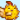

# Custom Icons

Add your own HUD icons to UI Info Suite 2 Alternative using Content Patcher. Icons appear alongside the built-in ones (luck, birthday, weather, etc.).

## Quick Start

1. Create a **20x20 pixel** icon image in your `assets/` folder.



2. Load the texture and add your icon in `content.json`:

```json
{
  "Format": "2.8.1",
  "Changes": [
    {
      "Action": "Load",
      "Target": "Mods/YourModId/Icons",
      "FromFile": "assets/icons.png"
    },
    {
      "Action": "EditData",
      "Target": "Mods/DazUki.UIInfoSuite2Alt/CustomIcons",
      "Entries": {
        "YourModId.MyIcon": {
          "Texture": "Mods/YourModId/Icons",
          "SourceRect": { "X": 0, "Y": 0, "Width": 20, "Height": 20 },
          "HoverText": "{{i18n:my-icon-tooltip}}"
        }
      },
      "When": {
        "Day": "15",
        "Season": "Spring"
      }
    }
  ]
}
```

3. Add UIInfoSuite2Alt as an optional dependency in `manifest.json`:

```json
{
  "Dependencies": [
    { "UniqueID": "DazUki.UIInfoSuite2Alt", "IsRequired": false }
  ]
}
```

4. See you icon appear on Spring 15:


If UI Info Suite 2 Alternative isn't installed, the patch is silently ignored.

## Fields

| Field | Required | Description |
|---|---|---|
| `Texture` | Yes | Your loaded texture asset name. |
| `SourceRect` | No | Region to draw from the texture. Default: `{ X: 0, Y: 0, Width: 20, Height: 20 }`. Use 20x20 for best result. |
| `HoverText` | No | Tooltip shown on hover. Supports `{{i18n:key}}` for translations. |

Icons should be **20x20 pixels**. The mod scales and centers them to match the built-in icons.

## When Icons Appear

Use `When` conditions like any other CP patch. The icon shows when the conditions are met and disappears when they're not.

### Example: Icon that disappears after a condition is met

This shows an icon reminding the player about a quest until they receive a mail flag (e.g. from completing it). Once the flag is set, the icon disappears and won't come back:

```json
{
  "Action": "EditData",
  "Target": "Mods/DazUki.UIInfoSuite2Alt/CustomIcons",
  "Entries": {
    "YourModId.QuestReminder": {
      "Texture": "Mods/YourModId/Icons",
      "SourceRect": { "X": 0, "Y": 0, "Width": 20, "Height": 20 },
      "HoverText": "You still need to complete the ritual!"
    }
  },
  "When": {
    "HasFlag": "YourModId.RitualStarted",
    "HasFlag |contains=YourModId.RitualComplete": false
  }
}
```

The icon appears once `YourModId.RitualStarted` is set and disappears permanently when `YourModId.RitualComplete` is set. `HasFlag` updates in real-time, so the icon disappears the moment the flag is added. No need to wait for the next day.

## Multiple Icons

Add multiple entries in one patch, or use separate patches with different `When` conditions:

```json
{
  "Action": "EditData",
  "Target": "Mods/DazUki.UIInfoSuite2Alt/CustomIcons",
  "Entries": {
    "YourModId.MarketDay": {
      "Texture": "Mods/YourModId/Icons",
      "SourceRect": { "X": 0, "Y": 0, "Width": 20, "Height": 20 },
      "HoverText": "{{i18n:market-day}}"
    },
    "YourModId.Festival": {
      "Texture": "Mods/YourModId/Icons",
      "SourceRect": { "X": 20, "Y": 0, "Width": 20, "Height": 20 },
      "HoverText": "{{i18n:festival-reminder}}"
    }
  },
  "When": {
    "Season": "Fall"
  }
}
```

A maximum of **5 custom CP icons** can be shown at any given time. Any beyond that are not displayed.


## Multi-Line Hover Text

Use `\n` to add line breaks in your tooltip or `\n\n` for an empty line:

```json
{
  "YourModId.MyIcon": {
    "Texture": "Mods/YourModId/Icons",
    "HoverText": "Line one\nLine two\n\nLine three with empty line above"
  }
}
```

## Some Good-To-Know Stuff

- Prefix entry keys with your mod ID to avoid conflicts (e.g. `YourModId.IconName`).
- Players can toggle custom icons on/off in the mod settings(+GMCM).
- Custom icons share a single position in the icon order settings for now("Icon Order" > "Custom Icons").
