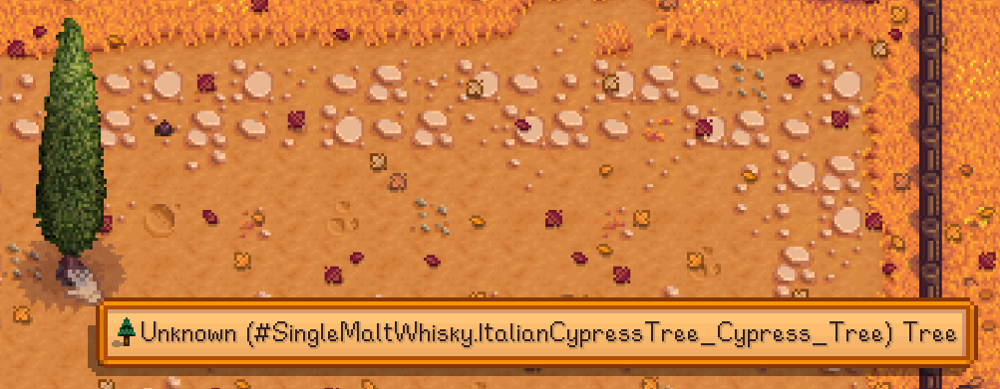
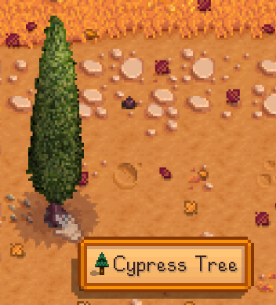

# Custom Wild Tree Names

Give your modded wild trees a proper name in UI Info Suite 2 Alternative's world tooltips and item range overlays using Content Patcher.

> Requires UI Info Suite 2 Alternative **v2.8.32 or newer**.

| Without the entry | With the entry |
|:---:|:---:|
|  |  |
| Falls back to `Unknown (#YourModId...)` | Shows your custom name |

_Example shown using [(CP) Cypress Tree for LatteHoln's Italian Town Buildings](https://www.nexusmods.com/stardewvalley/mods/48027)._

## Why This Exists

Tree names are hardcoded in UIIS2Alt. Vanilla and a few popular mods (Stardew Valley Expanded, Visit Mount Vapius, Cornucopia, Sunberry Village) have built-in names; everything else falls back to a generic label until I add it by hand and ship an update.

This custom field skips that wait. Add one line to your `Data/WildTrees` entry and the correct name shows up immediately - no UIIS2Alt update needed.

## Usage

Add a `CustomFields` entry with the key `UIIS2Alt/DisplayName` to your wild tree's `Data/WildTrees` entry:

```json
{
  "Action": "EditData",
  "Target": "Data/WildTrees",
  "Entries": {
    "YourModId.MyTree": {
      // ... your existing wild tree fields ...
      "CustomFields": {
        // ... your existing CustomFields ...
        "UIIS2Alt/DisplayName": "Cypress Tree"
      }
    }
  }
}
```

That's it. The name now shows in the wild tree's hover tooltip and in the seed-spread range overlay.

If UIIS2Alt isn't installed, the custom field is simply ignored by the game.

## Translations

Use a Content Patcher `{{i18n:}}` token to localize the name. The token is resolved by Content Patcher when the patch is applied, so UIIS2Alt receives the finished translated string:

```json
"CustomFields": {
  "UIIS2Alt/DisplayName": "{{i18n: tree.mytree.name}}"
}
```

Define the key in your mod's `i18n/default.json` (and per-language files):

```json
{
  "tree.mytree.name": "Cypress Tree"
}
```

## Where It Applies

`UIIS2Alt/DisplayName` is read only for **wild trees** (`Data/WildTrees`). It does not affect fruit trees, crops, bushes, or anything else - those resolve their names separately.
